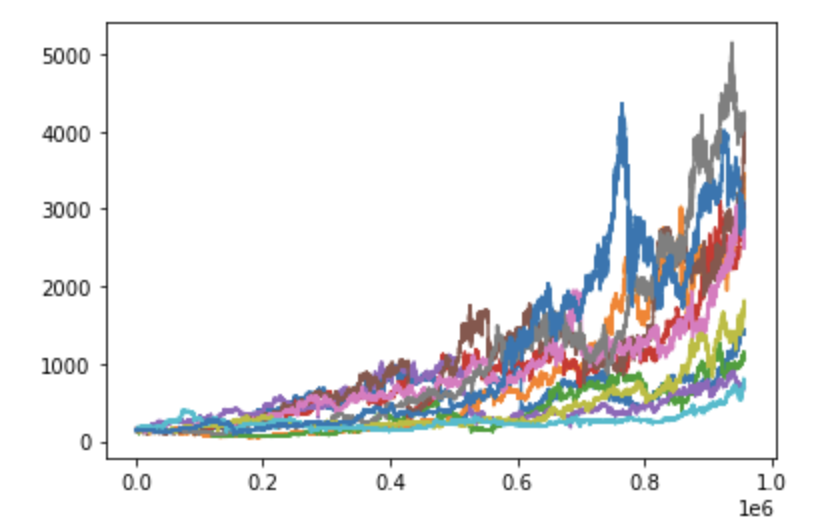
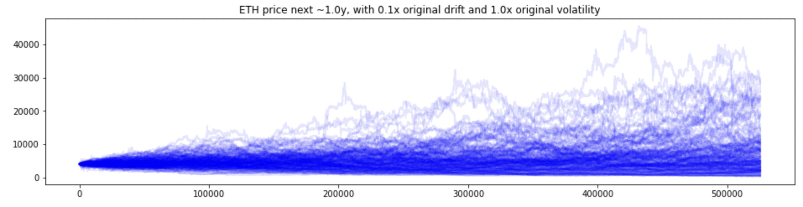

# eth_price_simulation

## What this is about
To check if and how well strategies might play out in different market scenarios, one needs some way to generate potential price paths.
Fitting stochastic processes on the distribution of past returns is one way to do so, but even the rather sophisticated approaches like Levy-processes come without autocorrelation patterns and adding them into those processes gives you easily six and more parameters to calibrate. On top, the implicit assumptions of ergodicity, stationarity etc. are quite hard to acknowledge when evaluating the strategy simulation results.
A simpler way (mustn’t be better :) is below sampling approach, where you just define what sort of past properties and movements you’d like to include as you can reflect those assumptions into your evaluation then. 

## How it works
Five steps:
1) Pull historical data (ideally small intervals), e.g. past 1-2years of minute data (see basedata folder)
2) Take log returns and standardize
3) Sample on those standardize returns, instead of single returns, pull windows of returns (configurable, e.g. 60mins to 4 days long) to preserve autocorrelation patterns. Also adjustable: draw with or w/o replacement (the latter keeps you closer to actual backtesting)
4) Define assumed/desired drift and volatility
5) Derive returns and price paths with 4)

## How it looks like

We can take the price ~1.8 years ago and create 'alternative paths' to the blue one that actually happened:

We can also look forward, assume less drift, but same volatility to get the following 200 sample paths:\

